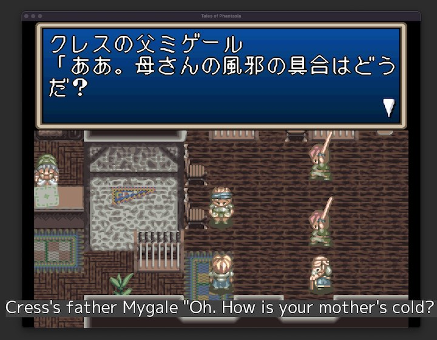

# Interpreter

This app can translate text captured from any application running on your computer. You just need to 
specify which window you want to sample and that's it.

The app uses:
* Google Cloud Vision to Extract the text on-screen
* Google Translate or DeepL to translate it

The translated text is then displayed as subtitles on a floating window that you can move anywhere.

It's typically used to translate Japanese retro games unreleased in the US but you can use for anything you wish to translate!



# How to use

Before you can use this app, you need some prerequisites:

* Go installed on your computer.
* A Google Cloud account.
* Alternatively, you can use DeepL instead of Google Translate for translation.

## Installing Go

In order to install go on your machine, [follow the instructions here](https://go.dev/doc/install)

## Setting up your Google Cloud account

* [Get a free Google Cloud account here](https://cloud.google.com/free) or use your existing account.
* [Create or Select a project](https://cloud.google.com/translate/docs/setup#project)
* [Enable billing](https://cloud.google.com/translate/docs/setup#billing)
* [Enable Cloud Vision API](https://cloud.google.com/vision/docs/setup#api) 
* [Enable Cloud Translation](https://cloud.google.com/translate/docs/setup#api) (You can skip this step if you're using the DeepL API)
* [Create Service Accounts and Keys](https://cloud.google.com/translate/docs/setup#creating_service_accounts_and_keys)
* [Use the Service Account Key File in Your Environment](https://cloud.google.com/translate/docs/setup#using_the_service_account_key_file_in_your_environment)
* Update the configuration file accordingly:
```yml
translator:
  api: "google"
  to: "en" # Target language
```

> Note: The list of Google Translate supported language is available [here](https://cloud.google.com/translate/docs/languages).

## Setting up your DeepL Account

As an alternative to Google Translate, you can use DeepL translate:

* [Get a free DeepL account here](https://www.deepl.com/pro-checkout/account?productId=1200&yearly=false&trial=false) or use your existing account.
* Update the configuration file accordingly:
```yml
translator:
  api: "deepl"
  to: "en" # Target language
  authentication-key: "your-deepl-authentication-key"
```

> Note: The list of DeepL supported language is available [here](https://www.deepl.com/en/docs-api/translating-text).
 
## Cloning the repository

```
git clone https://github.com/bquenin/interpreter.git
cd interpreter
```

## Configure Interpreter

Update the `interpreter.yml` configuration file:

```yml
window-title: "Tales"
refresh-rate: "5s"
confidence-threshold: 0.9
translator:
  api: "google"
  to: "en"
```

## Run Interpreter

```
go run ./cmd/interpreter/main.go
```

## Debug mode

In debug mode, `interpreter` will save the screenshots it takes to the current folder.

```
go run ./cmd/interpreter/main.go -d
```
